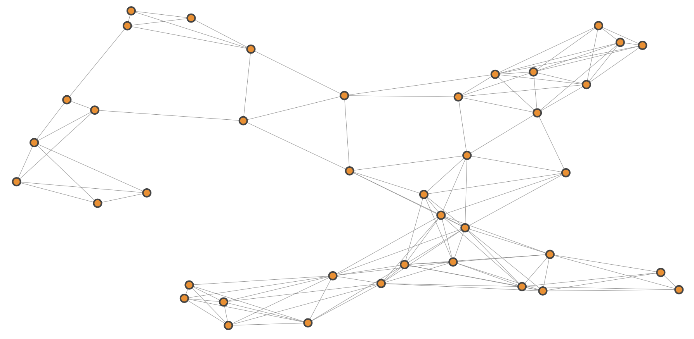
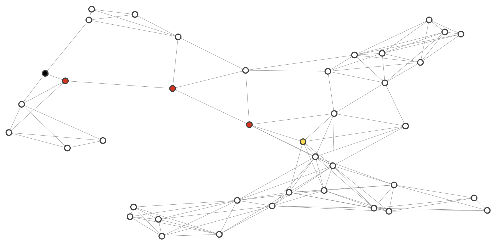

## Implement Route Planner
Build a route-planning algorithm (A-star search) to calculate the shortest path between two points on a map.

### Project Overview



#### Advanced Visualizations

The map above shows a network of roads which spans 40 different intersections (labeled 0 through 39). 

The `show_map` function which generated this map also takes a few optional parameters which might be useful for visualizing the output of the search algorithm you will write.

* `start` - The "start" node for the search algorithm.
* `goal`  - The "goal" node.
* `path`  - An array of integers which corresponds to a valid sequence of intersection visits on the map.



#### Write algorithm
The algorithm written will be responsible for generating a `path` like the one passed into `show_map` above. In fact, when called with the same map, start and goal, as above you algorithm should produce the path `[5, 16, 37, 12, 34]`. However you must complete several methods before it will work.

```bash
> PathPlanner(map_40, 5, 34).path
[5, 16, 37, 12, 34]
```
